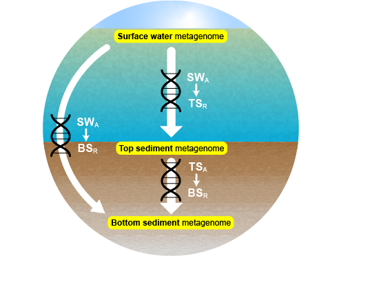

# Sediment metagenomes as time capsules of lake microbiomes 

Pipelines and scripts associated with the article

---

Garner RE, Gregory-Eaves I, Walsh DA. 2020. Sediment Metagenomes as Time Capsules of Lake Microbiomes. mSphere 5:e00512-20. https://doi.org/10.1128/mSphere.00512-20.

---

### Scripts

1. __01_pipeline.md__ Bioinformatics pipeline that begins with raw metagenome reads, (1) trims the raw reads, (2) assembles metagenomes from the trimmed reads, and (3) maps trimmed reads to the metagenomes.
2. __02_rnagenes.R__ Identify scaffolds containing conserved genes (ribosomal RNA or transfer rRNA genes) and count reads mapped (after removing scaffolds containing conserved genes).
3. __03_idhist.R__ Read mapping vs. sequence identity in captured metagenomes.
4. __04_genecontent.R__ Calculate gene counts on scaffolds in free and captured metagenomes.
5. __05_covlength.R__ Scaffold coverage vs. length.
6. __06_taxonomy.R__ Taxonomic analyses of free and captured metagenomes.
7. __07_genera.R__ Gene counts for selected taxa in free metagenomes.
8. __08_virusphylogeny.R__ Identify genes encoding Caudovirales terminase large subunit.
9. __09_mapgenomes.R__ Map metagenome reads to reference reference genomes accessed from IMG.

__Note on metagenome file names__: Numeric codes sometimes stand in for lake names: Lac Paula _06-126_, Eightmile Lake _17-054_, Grand lac Touradi _17-067_. Surface water metagenomes are named _watercolumn_, top sediment metagenomes _top_, and bottom sediment metagenomes _bottom_.
